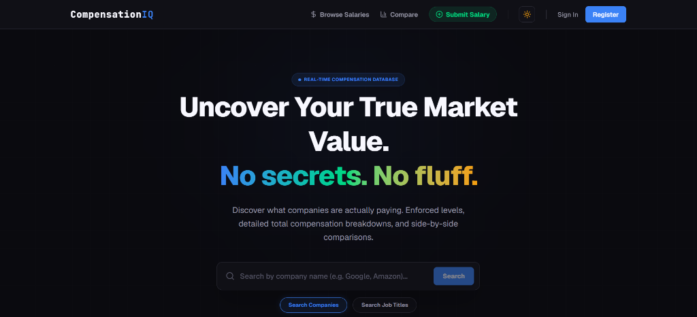

# 📊 CompensationIQ — Compensation Intelligence System

<div align="center">
  <p align="center">
    <strong>A next-generation, type-safe compensation intelligence platform designed for software engineers to discover, compare, and analyze real compensation data across major tech companies.</strong>
  </p>

  <p align="center">
    <a href="https://compensation-intelligence-system-xjtm.onrender.com" target="_blank">
      
    </a>
    
    
    
    
  </p>

  <h3>🌐 Live Website: <a href="https://compensation-intelligence-system-xjtm.onrender.com" target="_blank">compensation-intelligence-system-xjtm.onrender.com</a></h3>

  <br />

  
</div>

---

## 🌟 Key Features

*   **📊 Interactive Dashboard & Salary Table:** Browse normalized total compensation records with robust searching, pagination, and sorting by compensation, date, and level.
*   **⚖️ Side-by-Side Company Comparison:** Compare up to 3 tech organizations side-by-side with dynamic, responsive bar and line charts representing compensation bands.
*   **🎨 Precision Dark & Light Modes:** Sleek CSS variable-driven styling system with early hydration scripting to prevent flash of unstyled content (FOUC).
*   **🔒 Secure Credentials & Google Auth:** Password security using `bcryptjs` and session handling via NextAuth.
*   **🚪 Guest Bypass Gate:** Seamless unauthenticated browsing path with a client-side `sessionStorage` bypass handler to skip the 8-second authentication gates.
*   **📝 Step-by-Step Salary Submission:** Intuitive, validated form structure with schema validations to input clean records.

---

## 📊 Competitive Analysis & Market Observations

To build a premium compensation system, we analyzed existing market leaders to identify key differentiators:

### Feature Comparison Sheet

| Feature | Levels.fyi | 6figr | AmbitionBox | Glassdoor | CompensationIQ (Status) |
| :--- | :---: | :---: | :---: | :---: | :--- |
| **Salary by role + level** | Yes | Yes | Partial | Partial | **✅ Yes** (Enforced in DB schema) |
| **TC breakdown (base/bonus/equity)** | Yes | Yes | Partial | Partial | **✅ Yes** (Base, bonus, signing, and stock) |
| **Location normalization** | Yes | Yes | Yes | Yes | **✅ Yes** (City normalization utility) |
| **Company pages** | Yes | Yes | Yes | Yes | **✅ Yes** (With dynamic charts & filters) |
| **YoE filtering** | Yes | Yes | Yes | Yes | **✅ Yes** (Interactive filters in UI) |
| **Side-by-side comparison** | Yes | Partial | No | No | **✅ Yes** (Compare 2-3 companies side-by-side) |
| **Salary trend charts** | Yes | Partial | Yes | Yes | **✅ Yes** (TC by YoE and level charts) |
| **Anonymous submission** | Yes | Yes | Yes | Yes | **✅ Yes** (Default mode for all users) |
| **Verification system** | Yes | Partial | Partial | Partial | **📅 Planned** (Roadmap) |
| **Search autocomplete** | Yes | Yes | Yes | Yes | **✅ Yes** (Autocomplete for company select) |

### Key Observations: Why Levels Matter More Than Job Titles

In the modern tech industry, **job titles are highly misleading**. A "Senior Software Engineer" at one company can mean something completely different at another, both in terms of responsibilities and compensation.

*   **The Equivalency Gap:**
    *   **Google L5** (Senior Software Engineer) has an average total compensation of ~₹65L - ₹90L+ in India.
    *   **TCS Senior Consultant / Senior Engineer** has an average salary of ~₹15L - ₹22L in India.
    *   Both carry the word "Senior" in their titles, but the compensation difference is **3x to 4x**.
*   **Standardizing by Levels:**
    *   Leading tech companies use structured engineering levels (e.g., L3/SDE-1, L4/SDE-2, L5/Senior, L6/Staff).
    *   Mapping compensation to these levels allows job seekers to compare their offers accurately across peer companies (e.g., comparing Google L4 with Microsoft L61 or Amazon L5).
    *   Our platform **enforces levels** on submission and offers filtering based on normalized level groups (L3, L4, L5, L6) to provide high-fidelity insights.

---

## 📂 Repository File Structure

Below is the directory layout showing only the essential source code files:

```
├── app/                  # Next.js App Router Pages & API Routes
│   ├── (auth)/           # Authentication routes (Login / Register / split-screen design)
│   ├── (public)/         # Public client pages (Dashboard, Compare, Submit, Profiles)
│   ├── api/              # Core API endpoints (Salaries, Compare, Auth handlers)
│   ├── globals.css       # Global design system & HSL theme variables (:root)
│   └── layout.tsx        # Global root layout with theme hydration handling
├── components/           # Reusable UI & Layout Components
│   ├── layout/           # Shared page elements (Navbar, Footer, SearchBar, AuthGate)
│   ├── salary/           # Salary tables, details, filters, charts
│   └── ui/               # Lower-level elements (Badge, Skeleton, CookieConsent)
├── lib/                  # Utility Functions & Configuration Singletons
│   ├── auth.ts           # NextAuth configuration, providers, and authorize logics
│   ├── prisma.ts         # Prisma Client edge-optimized connection manager
│   ├── normalize.ts      # Normalization utilities (companies & cities)
│   ├── tc-calculator.ts  # Total Compensation (TC) calculation rules
│   └── validations.ts    # Zod schemas for input validation and sanitation
└── prisma/               # Database Schema & Data Seeding
    ├── schema.prisma     # Prisma schema defining tables and indexes
    └── seed.ts           # Seeding script populating 200+ realistic salary entries
```

---

## 🛠️ Tech Stack & Versions

*   **Framework:** Next.js 16.2 (App Router, Webpack build engine)
*   **Language:** TypeScript
*   **Database:** PostgreSQL (Edge-optimized connection pooling)
*   **ORM:** Prisma 7.8 (with Direct Driver Adapters)
*   **Styling:** Tailwind CSS v4.0 (CSS-first engine)
*   **Authentication:** NextAuth.js v4.24 (Credentials provider + Google OAuth)
*   **Data Visualization:** Recharts v3.8 (responsive bar, line, and layout charts)
*   **Validation:** Zod v4.4

---

## 🏗️ Architecture Decisions

Key design decisions are recorded in [docs/ADR.md](docs/ADR.md):
1. **Next.js API Routes** for backend logic to maintain single-repo simplicity.
2. **PostgreSQL & Prisma** for relational data safety and type-safe schema queries.
3. **Neon Serverless** for edge-optimized PostgreSQL deployment.
4. **Canonical Name Normalization** to merge variations like "Google LLC" and "Alphabet" under a single company profile.
5. **Computed & Indexed TC** to ensure total compensation queries are fast and performant.

---

## 💻 Local Setup & Development

### 1. Install dependencies
```bash
npm install
```

### 2. Setup environment variables
Create a `.env` file in the root directory:
```env
# Prisma database server connection URL
DATABASE_URL="your-postgresql-connection-string"

# Direct database connection URL (used for direct pool connections in pg driver)
DIRECT_DATABASE_URL="your-postgresql-direct-connection-string"
```

Create a `.env.local` file for Next.js:
```env
# Secure random string used for session tokens
NEXTAUTH_SECRET="your-secure-random-nextauth-secret"

# Local NextAuth address
NEXTAUTH_URL="http://localhost:3000"

# Optional: Google OAuth Credentials
GOOGLE_CLIENT_ID="your-google-client-id"
GOOGLE_CLIENT_SECRET="your-google-client-secret"
```

### 3. Start the database server
Prisma includes a dev database command. Start it in the background:
```bash
npx prisma dev --detach
```

### 4. Synchronize schema and seed data
```bash
# Push schema migrations
npx prisma db push

# Generate Prisma Client
npx prisma generate

# Seed 200+ realistic salary entries
npx prisma db seed
```

### 5. Run local dev server
We run the development server with the `--webpack` flag to bypass native worker crashes on Windows:
```bash
npm run dev
```
Open `http://localhost:3000` to browse the app.

---

## 🚧 Roadmap & Future Scope

*   **Verification System:** Add file uploads (W-2s, paystubs, offer letters) to verify salary data and mark entries with a verified checkmark.
*   **OAuth Integrations:** Full integration of Google & GitHub OAuth login flows.
*   **Search Autocomplete Expansion:** Migrate local autocomplete queries to an external service (like Clearbit autocomplete API) for international company validation.

---

<div align="center">
  <sub>Built by <a href="https://github.com/madhan1945" target="_blank">madhan1945</a></sub>
</div>
